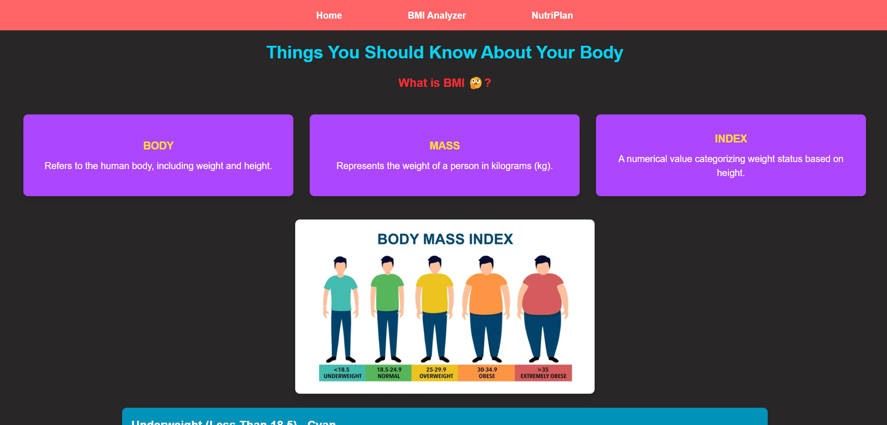
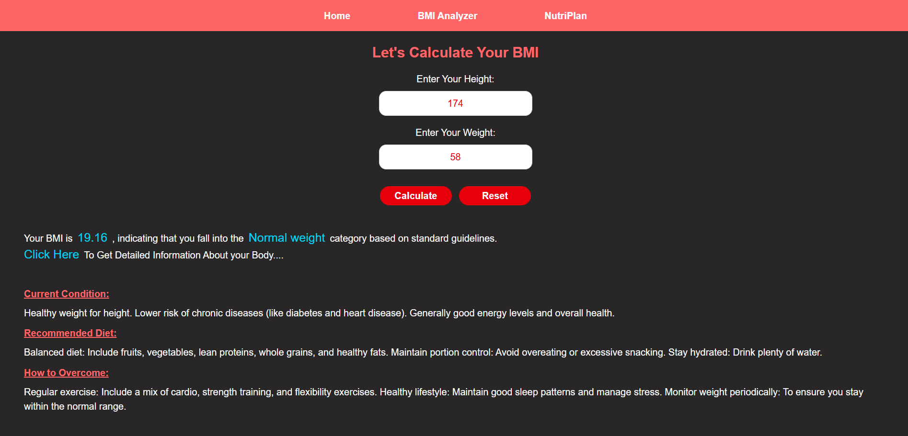
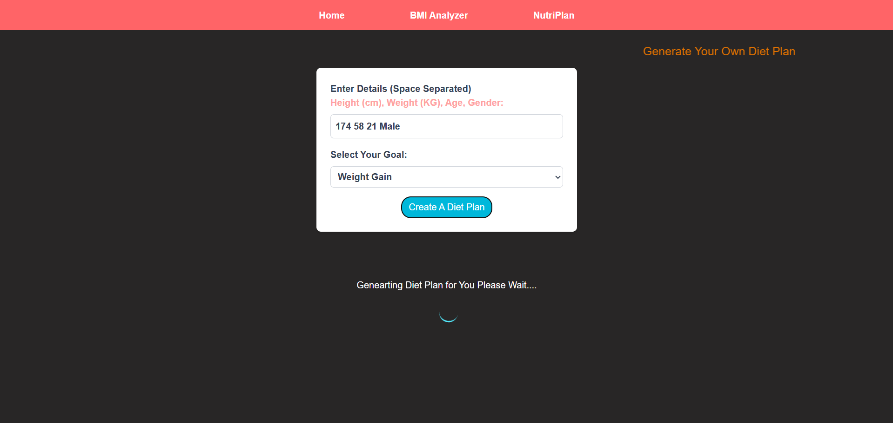

# NutriGuide App

NutriGuide is a web application designed to help users calculate their Body Mass Index (BMI) while generating personalized diet plans based on their fitness goals. This tool provides valuable insights into nutrition and calorie intake, making health tracking simple and effective.


## Technology Stack

This project uses React's useState, React Router, and the OpenRouter AI API to fetch and display real-time data efficiently.

## 🌍 API Resource

OpenRouter AI API:

```
https://openrouter.ai/settings/keys
```

## 🖥️ Preview
1st Preview

2nd Preview

3rd Preview


